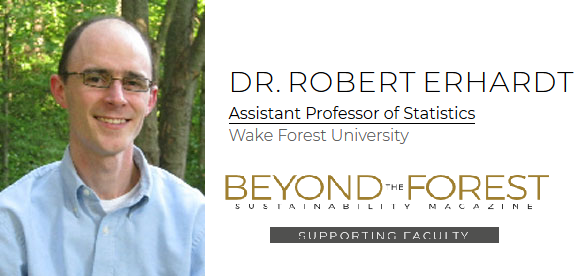
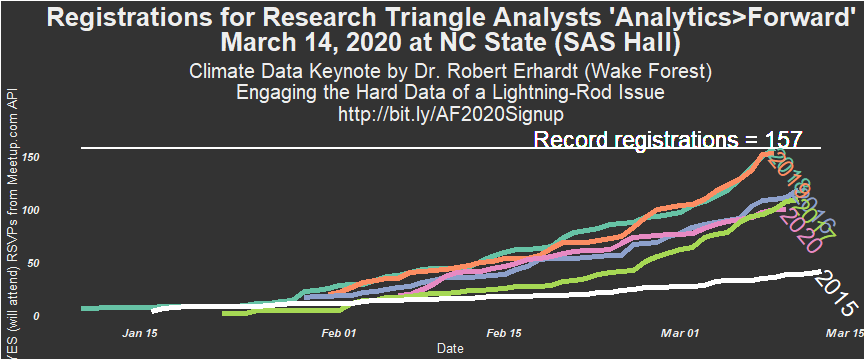
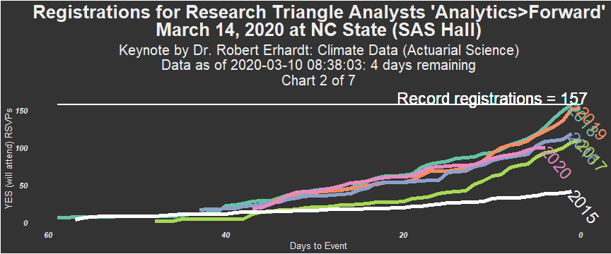
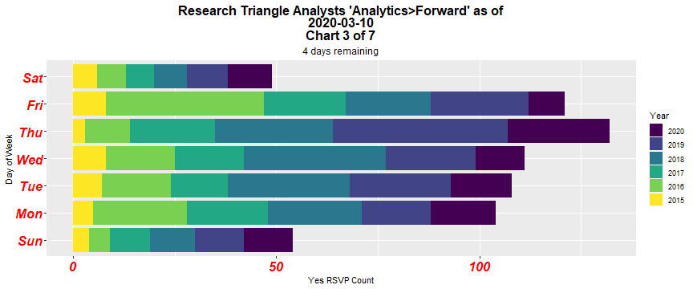
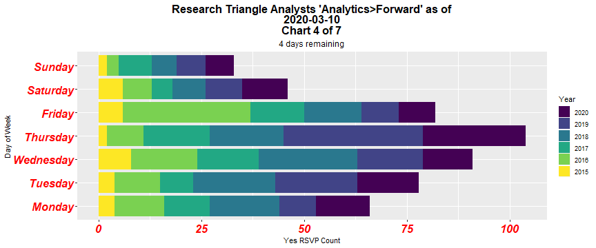
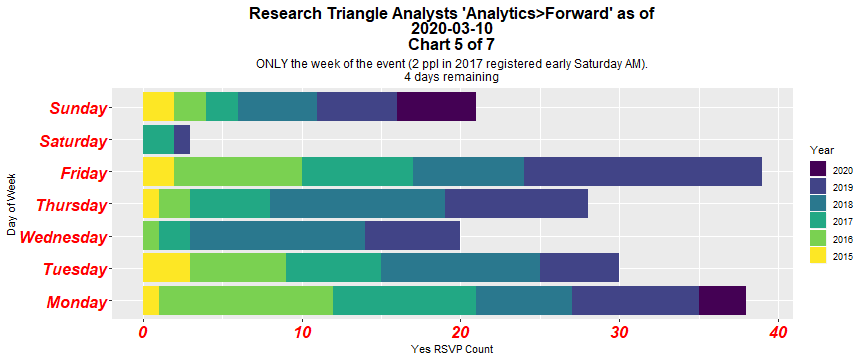
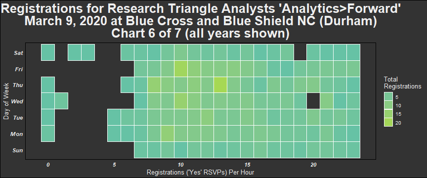
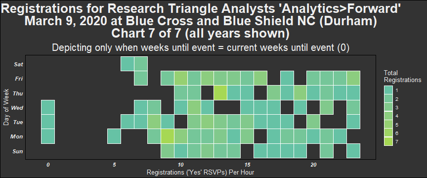
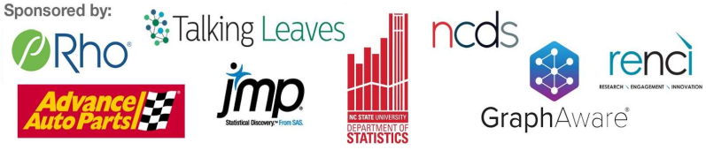

Analytics&gt;Forward 2020
================
Rick Pack (VP of Research Triangle Analysts)
March 10, 2020

"Analytics&gt;Forward" (2020) - 6th annual unconference by Research Triangle Analysts
=====================================================================================

"Pitch a talk, hear some talks, eat good food" \#AnalyticsForward <http://bit.ly/AF2020Signup>

This page's data visualizations will be updated daily.

They primarily depict Meetup Registrations for Analytics&gt;Forward, with the purpose of indicating sell-out potential and to help the planning comittee with elements including the catering order.

Thank you to R-Ladies for the meetupr package.

Keynote
-------

Charts
------

      

Week of event average Registrations per day
-------------------------------------------

### Prior to the current year and after 2015 (first year, lower Registrations)

| weekday\_rsvp |  Average\_RSVP\_weekday|
|:--------------|-----------------------:|
| Sun           |                    3.50|
| Mon           |                    7.75|
| Tue           |                    6.75|
| Wed           |                    4.75|
| Thu           |                    6.25|
| Fri           |                    9.00|
| Sat           |                    0.75|

### Current year

| weekday\_rsvp |  RSVP\_weekday|
|:--------------|--------------:|
| Sun           |              4|
| Mon           |              3|

Highest Performing Days (Registrations)
---------------------------------------

### All years - 5 Highest Performing Days

| name                                                                  | Meetup\_Start\_Date | Registration\_Date | Weekday |  Registration\_Count|
|:----------------------------------------------------------------------|:--------------------|:-------------------|:--------|--------------------:|
| Analytics&gt;Forward 2019                                             | 2019-01-31          | 2019-01-31         | Thu     |                   19|
| Analytics&gt;Forward 2020                                             | 2020-02-06          | 2020-02-06         | Thu     |                   18|
| Analytics&gt;Forward, with Keynote by John Sall, EVP of SAS Institute | 2016-01-29          | 2016-01-29         | Fri     |                   16|
| Analytics&gt;Forward 2019                                             | 2019-01-31          | 2019-03-08         | Fri     |                   15|
| Analytics&gt;Forward, with Keynote by John Sall, EVP of SAS Institute | 2016-01-29          | 2016-03-07         | Mon     |                   11|
| Analytics&gt;Forward 2018                                             | 2018-01-10          | 2018-03-07         | Wed     |                   11|
| Analytics&gt;Forward 2018                                             | 2018-01-10          | 2018-03-08         | Thu     |                   11|

### Current year - 5 Highest Performing Days

| name                      | Meetup\_Start\_Date | Registration\_Date | Weekday |  Registration\_Count|
|:--------------------------|:--------------------|:-------------------|:--------|--------------------:|
| Analytics&gt;Forward 2020 | 2020-02-06          | 2020-02-06         | Thu     |                   18|
| Analytics&gt;Forward 2020 | 2020-02-06          | 2020-02-10         | Mon     |                    7|
| Analytics&gt;Forward 2020 | 2020-02-06          | 2020-02-26         | Wed     |                    6|
| Analytics&gt;Forward 2020 | 2020-02-06          | 2020-02-08         | Sat     |                    5|
| Analytics&gt;Forward 2020 | 2020-02-06          | 2020-02-09         | Sun     |                    5|
| Analytics&gt;Forward 2020 | 2020-02-06          | 2020-02-25         | Tue     |                    5|
| Analytics&gt;Forward 2020 | 2020-02-06          | 2020-03-03         | Tue     |                    5|
| Analytics&gt;Forward 2020 | 2020-02-06          | 2020-03-08         | Sun     |                    5|

Total Registrations for Analytics&gt;Forward per year
-----------------------------------------------------

    ## [1] "As of  2020-03-10 08:38:46"

| name                                                                  |  Year|  Total\_Registrations|
|:----------------------------------------------------------------------|-----:|---------------------:|
| Analytics Forward - An Unconference                                   |  2015|                    41|
| Analytics&gt;Forward, with Keynote by John Sall, EVP of SAS Institute |  2016|                   119|
| Analytics&gt;Forward                                                  |  2017|                   109|
| Analytics&gt;Forward 2018                                             |  2018|                   157|
| Analytics&gt;Forward 2019                                             |  2019|                   153|
| Analytics&gt;Forward 2020                                             |  2020|                   100|

Current Year Analytics&gt;Forward Registration Link
===================================================

[Current Year Meetup Link](http://bit.ly/AF2020Signup "Analytics>Forward 2020 Meetup page")

For future collaborators
========================

To facilitate engagement by potential collaborators, the following discusses available files.

Loading the R Project
---------------------

After installing R and R-Studio, fork this repo by clicking fork at the top-right. Then follow [these instructions from the RStudio web site](https://support.rstudio.com/hc/en-us/articles/200532077-Version-Control-with-Git-and-SVN) to create a new project that is a clone of this version-controlled (think Github) repository. In the future, you can then double-click the AnalyticsForward\_2020.Rproj file to open RStudio with the files of this project being easily accessible.

Files
-----

1.  Readme.Rmd creates what appears on the Github page, including this text. +One
2.  Meetup\_RSVP\_Yes\_latest.R contains the Meetup\_RSVP\_Yes\_Count() function. You can use Readme.Rmd to understand how to use it.
3.  The .csv files contain data one could use with any program for analysis.
    -   Chuck Jaeger used Tableau to create this [Tableau storyboard](https://public.tableau.com/profile/chuck.jaeger#!/vizhome/AnalyticsForward2020/Storyboard).
    -   Related, although he used the JMP Meetup API, Xan Gregg created images including [this one on Twitter](https://twitter.com/xangregg/status/1104359495059337217). Xan inspired many updates to the data visualizations presented here and Chuck also provided some thoughts, including the key stimulus that began all my early 2020 work.
4.  animate\_sponsor\_coord.R is a quick-reference for stitching together images into an animated .GIF
5.  AF\_Pres.Rpres is a Xaringan presentation that has obvious imperfections I would love for others to help me fix.
6.  The RTAgrp .html files are what I called "Easter eggs" in my A&gt;F presentation. These can be opened in a web browser to see the use of [Joshua Kunst's](https://twitter.com/jbkunst) highcharter package, inspired by the work of 2018 keynoter, [Mara Averick](http://rpubs.com/maraaverick/470388).
7.  Other files are images used in the Analytics&gt;Forward presentation I did with Dr. Zeydy Ortiz. You can her gganimate() use for RSVPs at:
    -   <http://rpubs.com/zortiz/AnimatePlots>
    -   code available at <https://github.com/DrZeydy/share/blob/master/RSVP-animate.R>

More images
-----------

Plenty of \#AnalyticsForward images are available on Twitter and LinkedIn via \#AnalyticsForward as well as this Facebook album: (<http://bit.ly/2O126hX>)

Platinum Sponsors of A&gt;F 2020
--------------------------------

Where again can I register?
---------------------------

<http://bit.ly/AF2020Signup>
